✅ 1. Domain Controller Setup (DC01)
Deployed an Azure VM to act as the on-premises domain controller (DC01). Installed Active Directory Domain Services (AD DS) and configured a new domain:
corp.lab

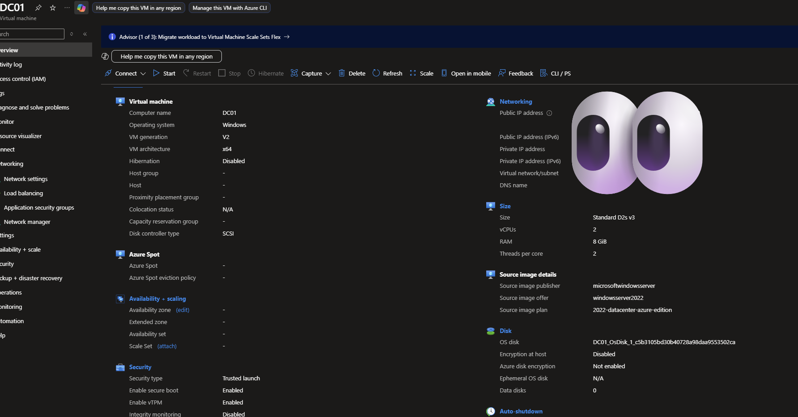

### ✅ Network Configuration

Configured DC01 networking within an Azure Virtual Network to simulate an on-premises environment.

 
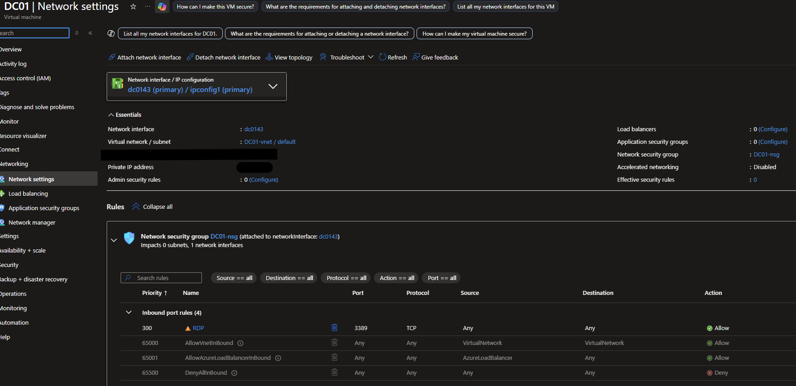

### 🔎 Why this matters

- Provides private network communication between domain and clients  
- Enables domain join capability  
- Supports DNS resolution for hybrid identity services  

Created a test user:
etest

🔎 Why this step matters

This establishes the identity source for the entire environment. All authentication, users, and devices originate from AD before syncing to the cloud.

---

✅ 2. Microsoft Entra Connect + Identity Sync
Installed Microsoft Entra Connect on DC01 and configured:

- Password Hash Synchronization
- Hybrid identity setup

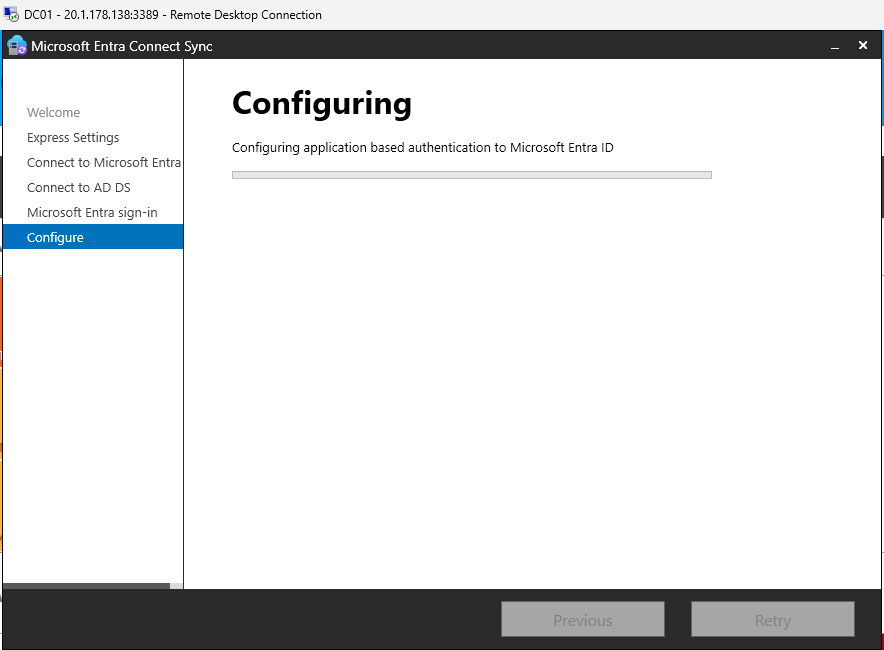

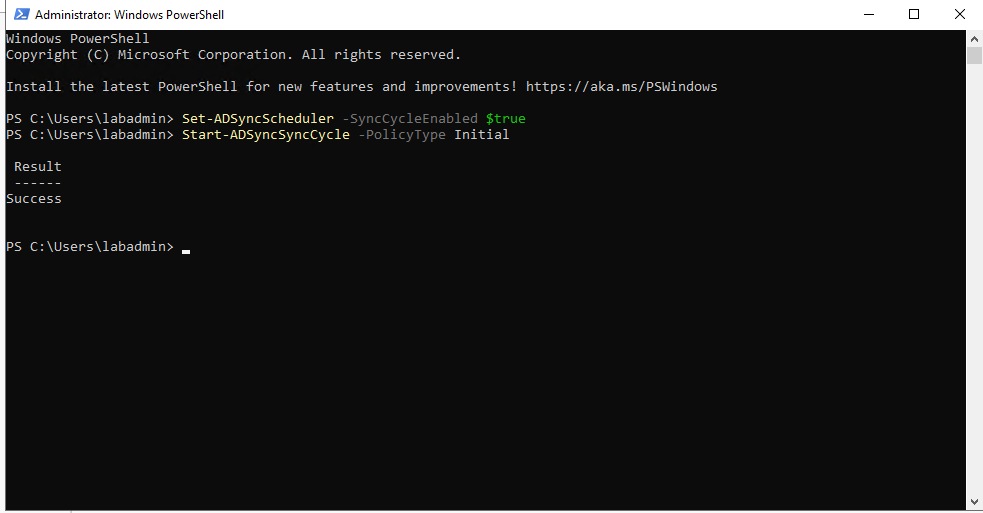
🔎 Why this step matters

This bridges:

On-prem AD → Microsoft Entra ID

Without this, users and devices cannot exist in both environments.

---

✅ 3. User Sync Verification
Verified that the on-prem user (etest) successfully synchronized to Microsoft Entra ID.

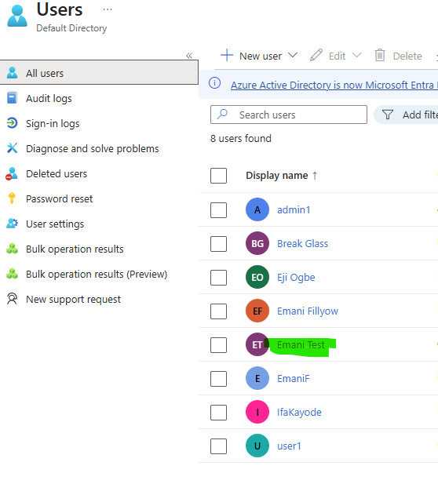
✅ Result

- User appears as “On-premises synced” in Entra
- Confirms identity lifecycle is working

---

✅ 4. CLIENT01 VM Creation
Created a Windows client VM (CLIENT01) to simulate an enterprise endpoint.

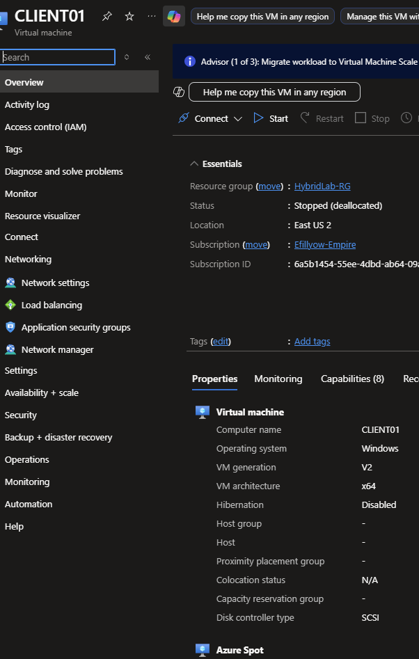

---

✅ 5. Domain Join (CLIENT01)
Joined CLIENT01 to the domain:
corp.lab

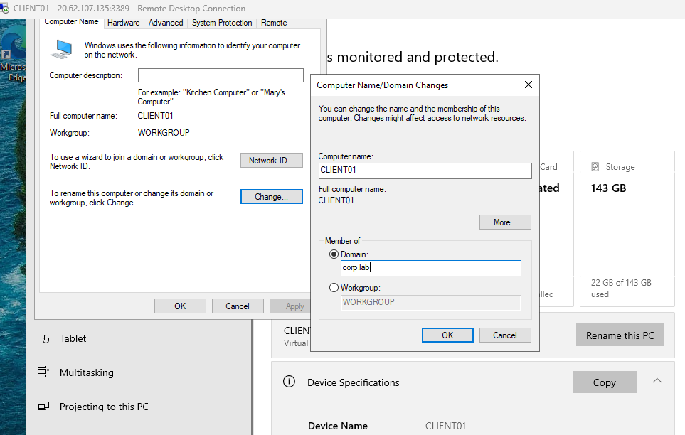
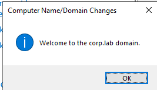

🔎 Why this matters

Devices must be:
Domain Joined ✅

before they can become:
Hybrid Joined ✅

---

✅ 6. Remote Access Configuration
Added the domain user (etest) to the local Remote Desktop Users group on CLIENT01.

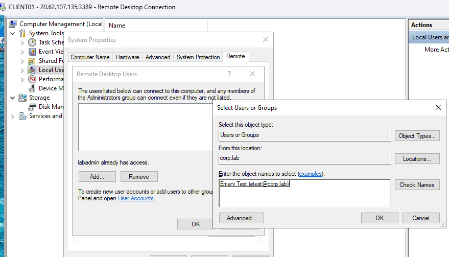

🔎 Why this matters

Domain users are not allowed to RDP by default. This step simulates real-world access control tuning.

---

✅ 7. On-Prem Authentication Validation
Logged into CLIENT01 using:
CORP\etest

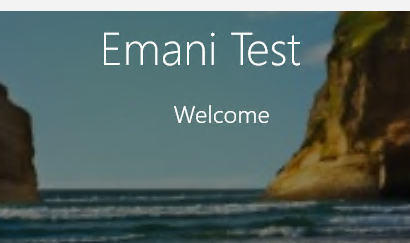

✅ Result

Confirms:

✅ User authentication works in AD

✅ Credentials valid BEFORE cloud dependency

---

✅ 8. Hybrid Azure AD Join (Manual Validation)
Validated hybrid join on CLIENT01 using:
dsregcmd /status

✅ Result
DomainJoined : YES
AzureAdJoined: YES

---

✅ 9. Service Connection Point (SCP) Configuration

Configured SCP so domain-joined devices can identify the Microsoft Entra tenant.
  
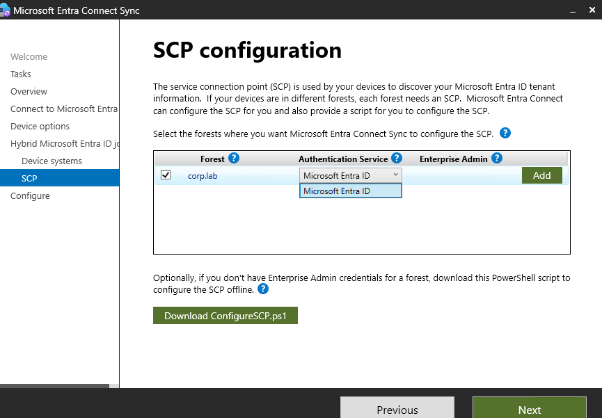

### 🔎 Why this matters

The SCP allows devices to:
- Discover Entra ID
- Register automatically during Hybrid Join

Without SCP:
❌ Hybrid join fails

---

✅ 10. Group Policy Automation
Created a GPO:
Hybrid-AAD-Join

Enabled:
Register domain-joined computers as devices

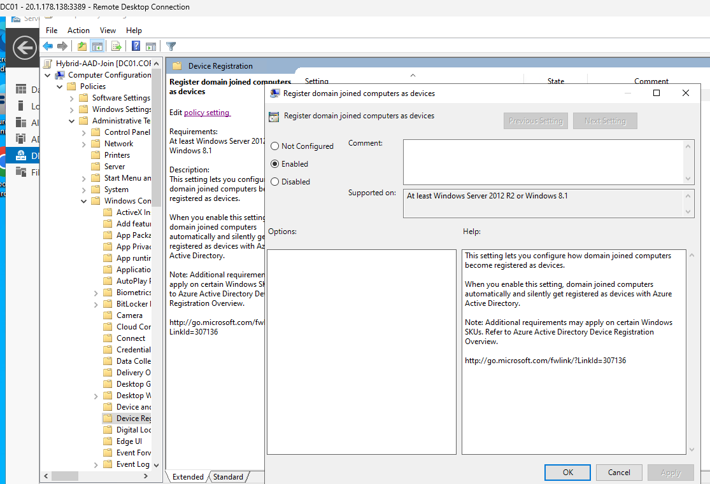

🔎 Why this matters

This enables:

✅ Automatic device registration
✅ Zero-touch onboarding
✅ Enterprise scalability

---

✅ 11. CLIENT02 VM Creation (Automation Test)
Created a second client VM to validate automation.

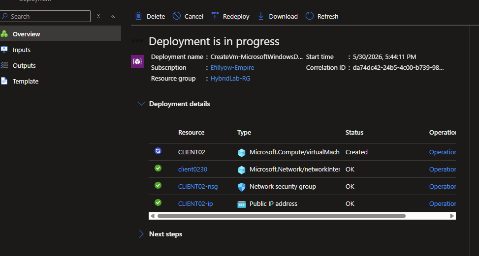

---

✅ 12. Automated Hybrid Join Validation
Steps performed:

Joined CLIENT02 to domain
Logged in with etest
Waited (no manual commands)

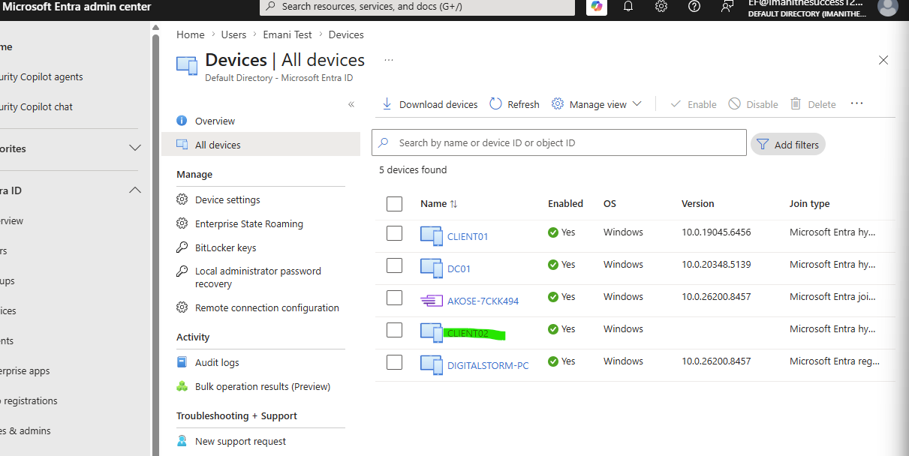

✅ Result

-✅ Device hybrid joined automatically
-✅ No manual dsregcmd required
-✅ GPO successfully triggered join process

---

🧠 Troubleshooting Highlights

🔴 Issue: Hybrid Join Failed (Event ID 304)
Error:
Device object not found

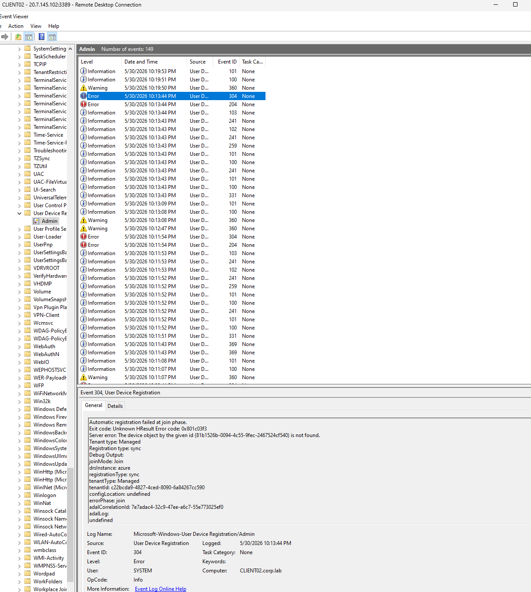

🔍 Root Cause
Device attempted to register before being synced to Entra ID

✅ Resolution

Ran in Powershell:

Start-ADSyncSyncCycle -PolicyType Initial

Waited for device object to appear in Entra
Retried join → SUCCESS

🔴 Issue: GPO Not Applying
✅ Fix
Verified using:

BATgpresult /r /scope computer

Confirmed:

Hybrid-AAD-Join policy applied ✅

🔴 Issue: DNS Concerns
✅ Fix
Validated:
nslookup login.microsoftonline.com

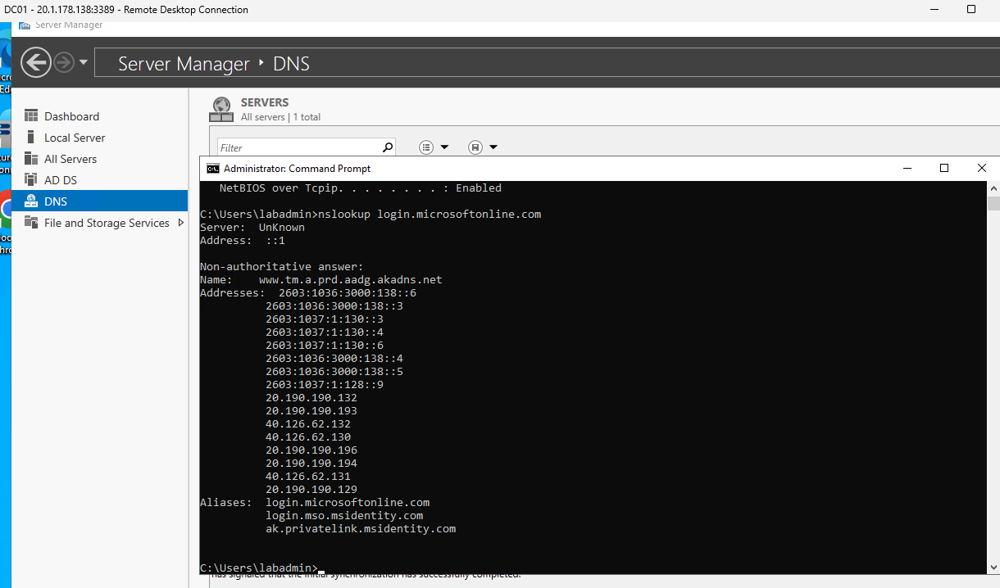
Ensured DC01 forwards DNS requests correctly

✅ Result

- Successful resolution of Microsoft endpoints
- Confirms proper DNS forwarding and internet connectivity

🔎 Why this matters
Required for:

- Authentication requests
- Device registration
- Hybrid join communication

🎯 Outcome

✅ Hybrid identity successfully implemented

✅ Device registration automated via GPO

✅ Identity + device lifecycle validated

✅ Troubleshooting completed using real enterprise methods

💼 Skills Demonstrated

- Active Directory Deployment

- Azure VM Infrastructure

- Microsoft Entra Connect

- Hybrid Identity Architecture

- Group Policy Automation

- Device Registration (Hybrid Join)

- Troubleshooting:

- Event Viewer

- Sync pipelines

- DNS resolution

- Group Policy
